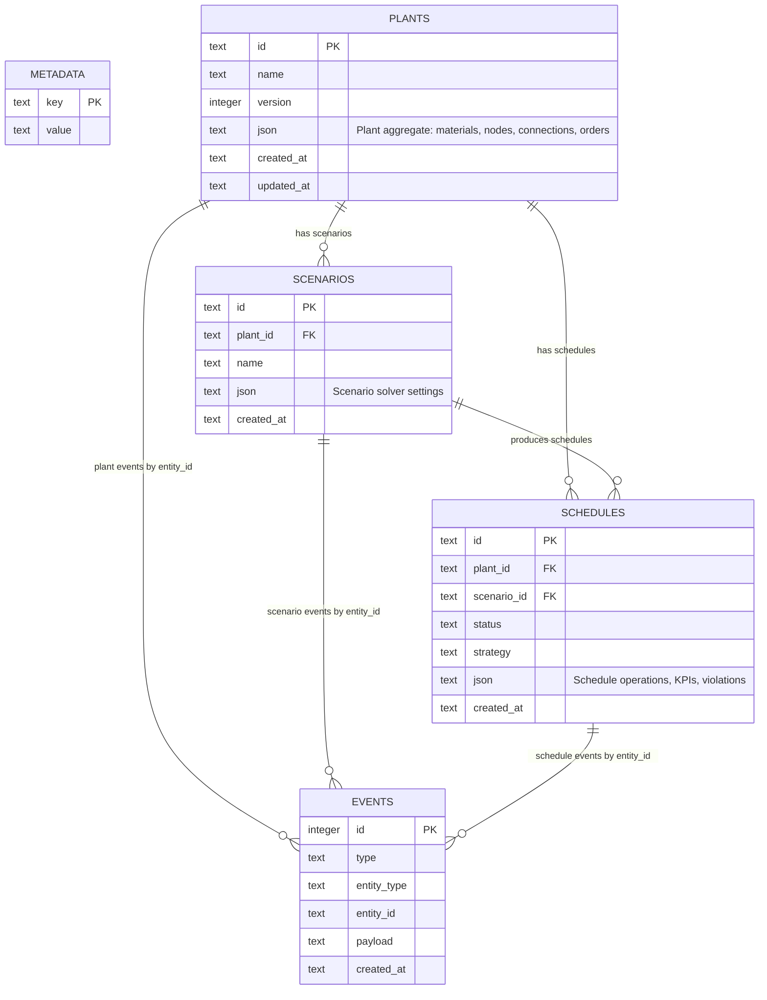

# ForgePlan Backend y modelo de datos

## Decisión de arquitectura MVP

ForgePlan sigue siendo **local-first**. El backend implementado es un servidor HTTP local sobre Node.js + SQLite, sin auth ni servicios externos. La base de datos persiste agregados completos como JSON validado por Zod, y mantiene columnas resumen para listar/buscar rápido.

## Modelos backend necesarios

- **Plant**: agregado raíz de una planta productiva. Contiene el modelo visual y operativo.
- **Material**: producto/material planificable. Vive dentro de `Plant.materials`.
- **PlantNode**: equipo/recurso/nodo industrial. Vive dentro de `Plant.nodes`.
- **Connection**: flujo entre equipos. Vive dentro de `Plant.connections`.
- **Order**: demanda/pedido a planificar. Vive dentro de `Plant.orders`.
- **Scenario**: configuración de solver para una versión de planta.
- **Schedule**: resultado de planificación.
- **StoreEvent**: evento append-only de auditoría local.

## Endpoints REST implementados

- `GET /api/health`
- `GET /api/models`
- `GET /api/plants`
- `POST /api/plants`
- `GET /api/plants/:id`
- `GET /api/plants/:id/readiness`
- `GET /api/plants/:id/export`
- `POST /api/plants/import`
- `GET /api/scenarios?plantId=...`
- `POST /api/scenarios`
- `GET /api/scenarios/:id`
- `GET /api/schedules?scenarioId=...`
- `GET /api/schedules/:id`
- `POST /api/solve/mock`
- `GET /api/events?limit=100`

## Diagrama ERD

## Nota de normalización

Para este MVP no he separado `materials`, `nodes`, `connections` y `orders` en tablas propias porque todavía interesa mover/importar/exportar el modelo como un único JSON local. Si más adelante necesitamos consultas analíticas, edición colaborativa o sincronización parcial, el siguiente paso sería normalizar esas colecciones o añadir tablas índice derivadas.
